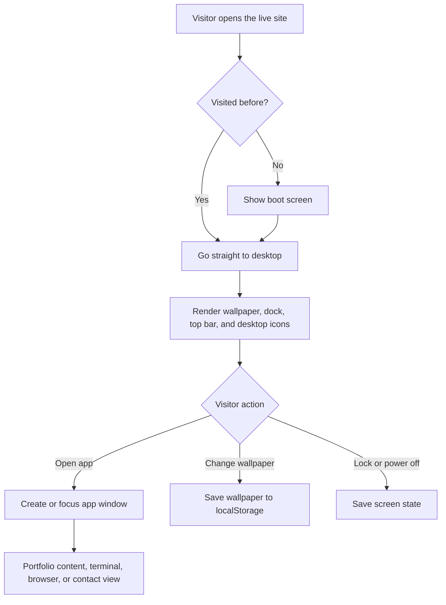
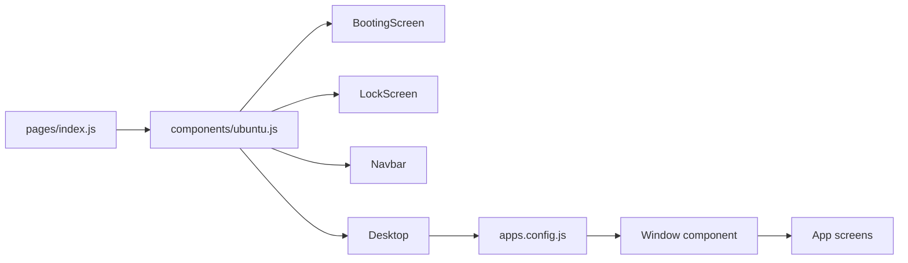

<div align="center">

# Port-try

[](https://nextjs.org/)
[](https://react.dev/)
[](https://tailwindcss.com/)

An Ubuntu-style portfolio experiment with windows, desktop shortcuts, a dock, a terminal, and small interactive apps.

[Live site](https://konseptt.github.io/Port-try/) | [GitHub repo](https://github.com/Konseptt/Port-try)

</div>

## Why I built this

I wanted my portfolio to feel less like a static page and more like a place you can poke around. This project wraps my work, contact links, and personality inside a fake Ubuntu desktop, so visitors can open apps instead of scrolling through the usual sections.

It is also a playground for UI state, draggable windows, app launchers, local storage, and little details that make the site feel alive.

## What is inside

- A boot screen, lock screen, desktop, top bar, and side dock
- App windows for Chrome, VS Code, Terminal, Spotify, Settings, Trash, Contact Me, and About
- Draggable window behavior with focus, close, and app state management
- Local storage for wallpaper, boot state, lock state, and shutdown state
- Google Analytics hooks for screen transitions
- Yaru-style theme assets and custom wallpapers

## Live website flow



## App architecture



## Tech stack

| Layer | Tools |
|---|---|
| Framework | Next.js, React |
| Styling | Tailwind CSS, custom CSS |
| Interactions | react-draggable, localStorage |
| Utilities | jQuery, expr-eval |
| Analytics | react-ga4 |

## Run locally

```bash
npm install
npm run dev
```

Then open:

```text
http://localhost:3000
```

To create a static export:

```bash
npm run build
npm run export
```

## Notes

This started as a portfolio experiment, so some app names and content are intentionally playful. The important part for me was making the site feel clickable, tactile, and a little nostalgic.
